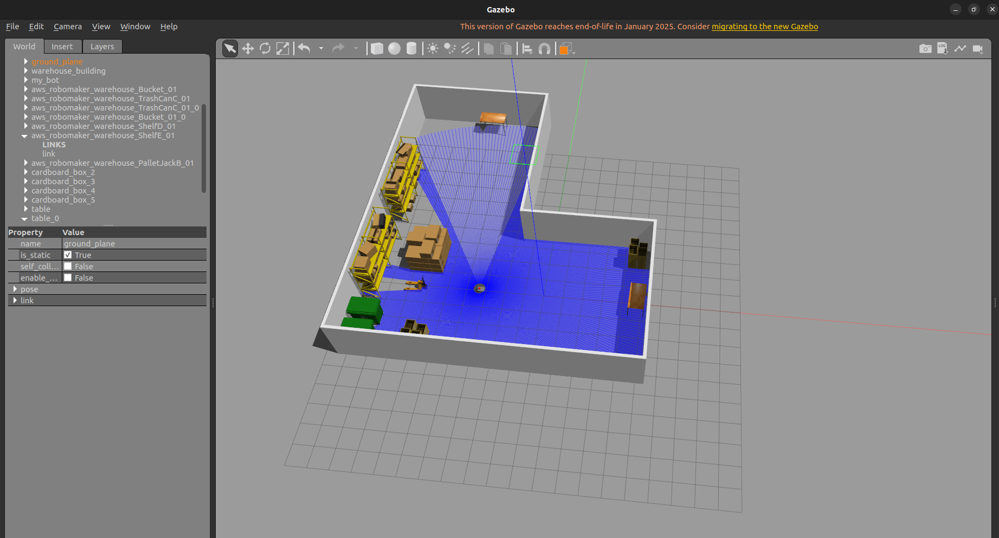
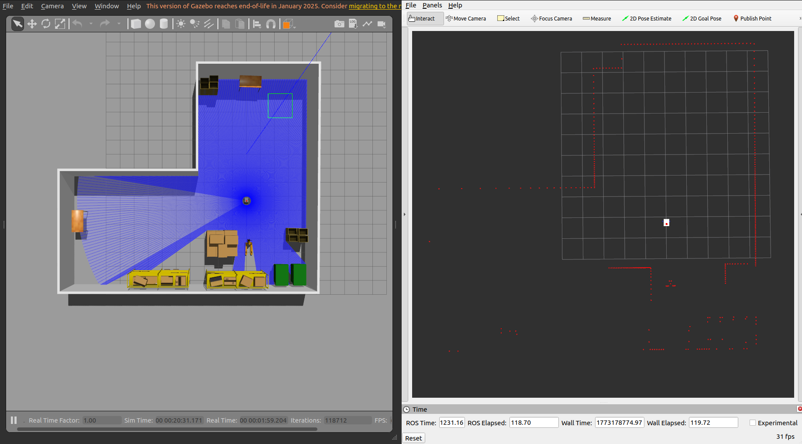
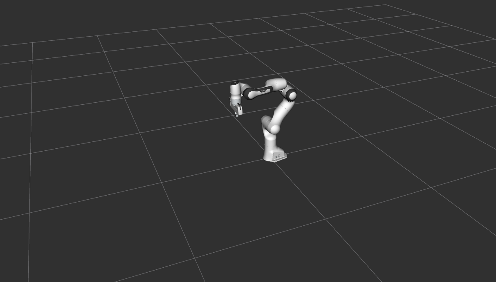

# Warehouse Autoloader Robot

Simulated warehouse robot capable of autonomous navigation and autonomous loading and unloading of cargo.

Transporation robot is triggered to a loading station. The robot autonomously navigates to the loading station then gets loaded with cargo by the Panda arm. After loading is complete, the robot will navigate to the unloading station where another Panda arm will unload the transpotation robot. Finally, the robot will move to its docking station until a new mission is triggered. 

**Work in Progress. Full readme coming soon**

## Details:

### Simulation and Testing:
- Custom and modified prebuilt urdf models of robots.
- Gazebo Classic for simulating robot usage in warehouse environment.
- RVIZ to test ROS2 robot infrastructure.

### Transportation Robot
- Using slam_toolbox for localization and map creation.
- using Nav2 for robot navigation.
- Developed custom launch file for starting simulation, Rviz, spawn robot, and load warehouse world.
- Created custom urdf file for robot (using simplified robot, finalized version is work in progress).

### Loader Arm
- Using ROS2 Control for interacting with robot hardware.
- Custom launch file for starting simulation and spawn robot.
- Using MoveIt to control robot arm and trajectory execution (Work in progress).

Recently accomplished: Successful SLAM and navigation tests on test transportation robot.

Currently working on: Integrating Panda arm with test transportation robot. 

Next: Add finilzed transportation robot model into Gazebo

    

    

    

